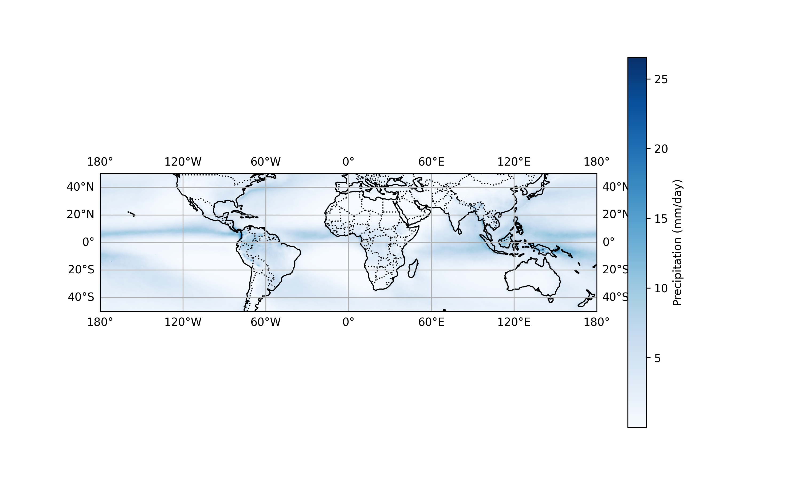

# Global Precipitation Distribution (2010–2019)



This project visualizes global precipitation data using the TRMM dataset (2010-2019). It produces high-quality static maps, showing precipitation patterns across the globe with clear latitude and longitude coordinates. The aim of this project is to present meaningful insights into precipitation trends, particularly focusing on global and regional variations.

## 📑 Table of Contents

- [Project Overview](#project-overview)
- [Features](#features)
- [Requirements](#requirements)
- [Data](#data)
- [Usage](#usage)
- [Directory Structure](#directory-structure)
- [Customization](#customization)
- [Contributing](#contributing)
- [License](#license)
- [Acknowledgements](#acknowledgements)

## Project Overview

This project leverages the TRMM (Tropical Rainfall Measuring Mission) dataset, which provides precipitation data globally. The data is processed using Python libraries like `xarray`, `matplotlib`, and `cartopy` to generate static visualizations. The maps produced by this project focus on global precipitation patterns over the span of 2010-2019.

## Features

- Visualizes global precipitation data for the years 2010 to 2019.
- Static map generation showing global precipitation trends.
- Maps include latitude and longitude gridlines, with cartographic elements like country borders and coastlines.
- Uses Cartopy to display essential map features such as land and sea, improving the clarity of precipitation patterns.

## Requirements

To run this project, ensure you have the following Python dependencies installed:

- Python 3.x
- `xarray` (for handling NetCDF data)
- `matplotlib` (for creating plots)
- `cartopy` (for geographical map projections)

### Install the dependencies

```bash
pip install xarray matplotlib cartopy
```

## Data

The data used in this project comes from the TRMM (Tropical Rainfall Measuring Mission) dataset, covering daily precipitation data from 2010 to 2019. You can download the dataset from the NASA's TRMM website: [NASA TRMM Data](https://giovanni.gsfc.nasa.gov/giovanni/#service=TmAvMp&starttime=2010-01-01T00:00:00Z&endtime=2019-12-12T23:59:59Z&data=TRMM_3B42_Daily_7_precipitation&dataKeyword=Precipitation).

### Data Format

The dataset is in NetCDF format (`.nc`), and the precipitation variable is labeled as `TRMM_3B42_Daily_7_precipitation`.

## Usage

After setting up the necessary dependencies, follow these steps to generate a global precipitation map:

### Steps to Run the Script

1. Clone the repository:

   ```bash
   git clone https://github.com/eritech98/climate-scenarios-kenya.git
   cd climate-scenarios-kenya
   ```

2. Run the script to generate the global precipitation map:

   ```bash
   python scripts/visualize_precip.py
   ```

   This script will generate a global precipitation map. The image will be saved in the `outputs/static_maps/` directory.

3. The output image will be saved as `global_precipitation_with_coords.png`.

## Directory Structure

```
climate-scenarios-kenya/
│
├── data/                # Contains the precipitation dataset (e.g., .nc files)
│
├── scripts/             # Python scripts for generating visualizations
│   ├── visualize_precip.py    # Main script to visualize global precipitation
│
├── outputs/             # Contains output images and graphs
│   └── static_maps/     # Folder where the global precipitation images are saved
│
└── README.md            # Project documentation
```

## Customization

- **Map Projection**: The script uses the `PlateCarree` projection. You can easily change the map projection to alternatives like `Mercator`, `Orthographic`, or others provided by Cartopy.
- **Colormap**: The default colormap is `Blues`, which is suitable for visualizing precipitation. You can replace it with any other colormap such as `viridis`, `plasma`, or `inferno` to adjust the visual style.
- **Region of Interest**: While the script generates global maps by default, you can modify it to focus on a specific region by adjusting the latitude and longitude ranges or data used.

## Contributing

If you have ideas for improving this project or would like to add new features, feel free to fork the repository and submit pull requests. Contributions are welcome!

## License

This project is licensed under the MIT License.

## Acknowledgements

- The TRMM dataset is provided by NASA and is used here for educational and research purposes.
- This project utilizes the following Python libraries:
  - `xarray` for handling multidimensional arrays and NetCDF files.
  - `matplotlib` for creating static visualizations.
  - `cartopy` for map projections and features.

